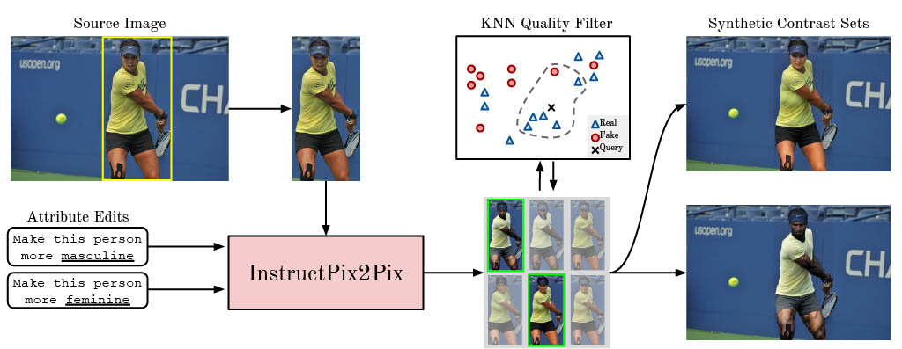

# Balancing the Picture: Debiasing Vision-Language Datasets with Synthetic Contrast Sets

[](figures/gensynth_pipeline.jpg)

This repository hosts the code associated with our research project, entitled "Balancing the Picture: Debiasing Vision-Language Datasets with Synthetic Contrast Sets". Our research explores the use of synthetic contrast sets for debiasing vision-language datasets.

## Authors and Correspondence
The authors of this project include:

- [Brandon Smith](https://brandonsmith.co.uk/)
- [Miguel Farinha](https://github.com/mlfarinha)
- [Siobhan Mackenzie Hall](https://github.com/smhall97)
- [Hannah Rose Kirk](https://www.hannahrosekirk.com/)
- [Aleksandar Shtedritski](https://github.com/suny-sht)
- [Max Bain](https://maxbain.com)

For any inquiries or further information, please contact our corresponding authors, Brandon Smith, <brandonsmithpmpuk@gmail.com>, or Miguel Farinha, <miguelffarinha@gmail.com>.

## Paper
Details of our paper can be found in the [link here]().

### measure_bias.py
`measure_bias.py` operates on the COCO val 2017 image dataset to measure the bias metrics, Bias@K and MaxSkew@K. 

#### Usage
The script can be used by running the following command:

```bash
python measure_bias.py [options]
```

The available options are:

- `--model`: Specifies the model type. Choices include "bert", "random", "tfidf", "clip", "clip-clip100", "debias-clip". The default value is "bert".
- `--balanced_coco`: A flag that indicates whether to use a balanced COCO dataset. If this option is included in the command, the script will use a balanced COCO dataset.
- `--data_dir`: Specifies the data directory. The default value is "/tmp/COCO2017".

The data_dir must be structured as follows:

```plaintext
coco
│
└─── annotations
│   │   captions_val2017.json
│   │   captions_train2017.json
│
└─── images
    │   *.jpg
```

The script will output bias measurements to the console.

### gensynth_measure_bias.py
`gensynth_measure_bias.py` is a script that measures the bias metrics, Bias@K and MaxSkew@K, over the stable diffusion edit images generated from the COCO train 2017 image dataset or the original COCO train 2017 images corresponding to the unique IDs used to generate the edited images.

#### Usage
To use the script, run the following command:

```bash
python gensynth_measure_bias.py [options]
```

The available options are:

- `--model`: Specifies the model type. Choose from the following options: "random", "clip", "open-clip", "clip-clip100", "debias-clip". The default value is "clip".
- `--balanced_coco`: A flag that indicates whether to use a balanced COCO dataset. Include this option in the command if you want to use a balanced COCO dataset.
- `--dataset`: Specifies the dataset to compute bias@k and maxskew@ for. Choose either "gensynth" or "gensynth-coco".
- `--gensynth_data_dir`: Specifies the directory for GenSynth data. This should include the `gensynth.json` file and edited image subdirectories. It is a required argument.
- `--coco_data_dir`: Specifies the directory for COCO data. It is a required argument.

The directory structure for `--coco_data_dir` should be the same as for data_dir above.

Please note that the `--model` option now includes additional choices such as "open-clip", and the `--dataset`, `--gensynth_data_dir`, and `--coco_data_dir` options have been added to the available options.

The `--dataset` option contains two options:
- `gensynth-coco` tells the script to compute the bias metrics on the unique COCO train 2017 image IDs corresponding to the images in the `--gensynth_data_dir`.
- `gensynth` tells the script to compute the bias metrics over all the edited images in `--gensynth_data_dir`.

## License
This project is licensed under the [MIT License](). Please see the `LICENSE` file for more information.

## Acknowledgements
We wish to acknowledge the support and contributions of everyone who made this project possible.

Miguel Farinha acknowledges the support of Fundação para a Ciência e Tecnologia (FCT), through the Ph.D. grant 2022.12484.BD.

This work has been supported by the Oxford Artificial Intelligence student society, the EPSRC Centre for Doctoral Training in Autonomous Intelligent Machines & Systems [EP/S024050/1] (A.S.), and the Economic and Social Research Council Grant for Digital Social Science [ES/P000649/1] (H.R.K.).

For computing resources, the authors are grateful for support from Google Cloud and the CURe Programme under Google Brain Research, as well as an AWS Responsible AI Grant.

## Citation
We are in the process of submitting the paper to arXiv and will update when done.
